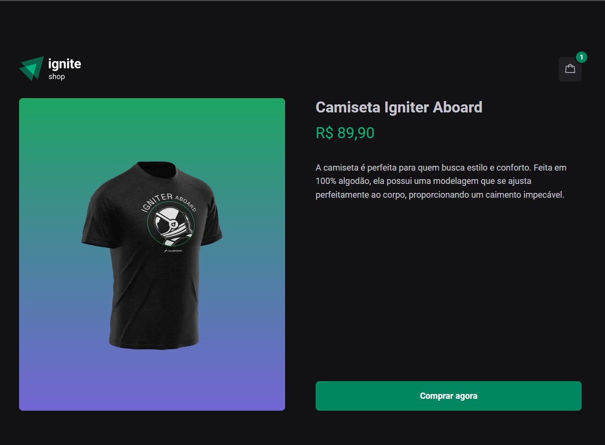

# Ignite Shop

Essa aplicação foi desenvolvida durante a trilha de formação React da Rocketseat. Utilizando Next e usando a API do Strapi

## Executando

Após clonar o repositório, acesse a pasta do projeto e execute os comandos abaixo:

```sh
npm install
npm run dev
```

Acesse <http://localhost:5173> para visualizar a aplicação.

## Imagens

Página do produto
<p align="center">
  
</p>
